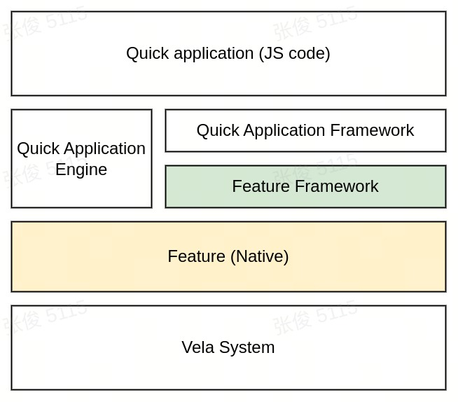
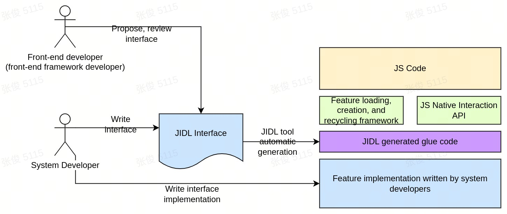
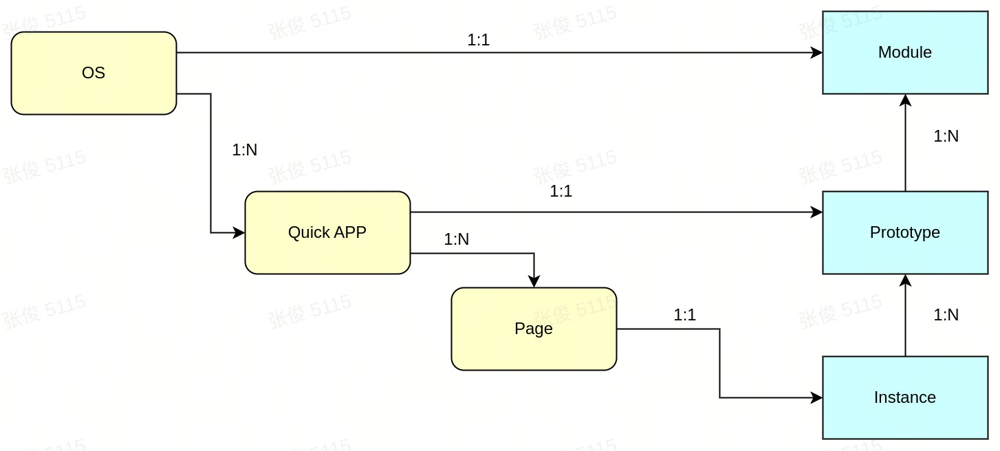
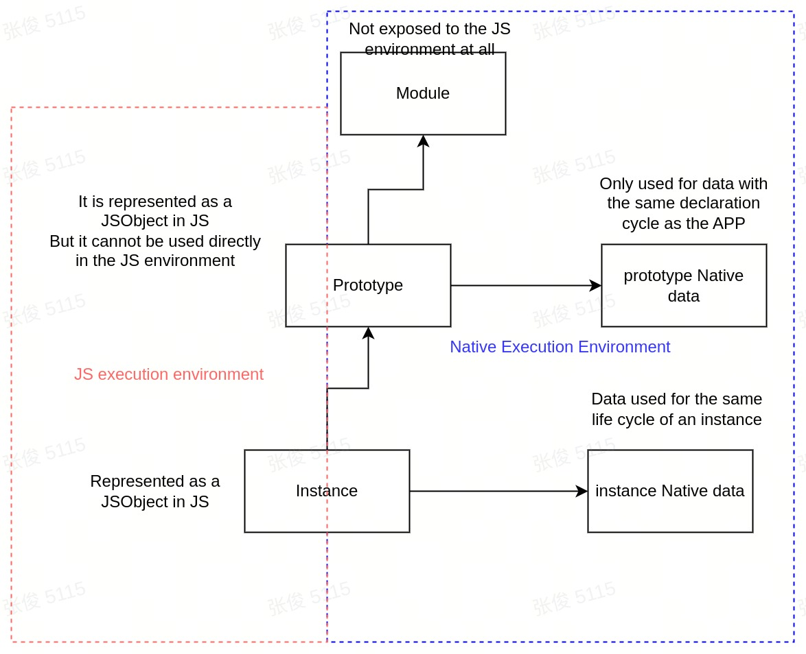
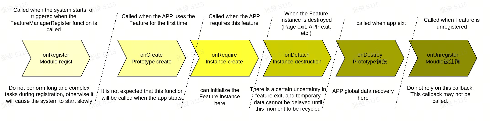
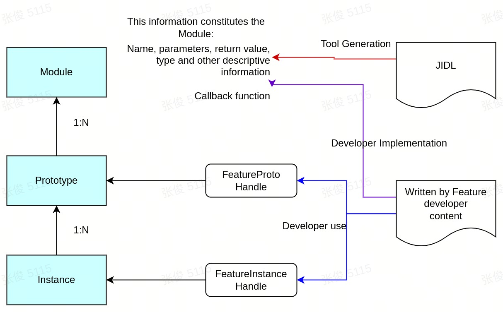
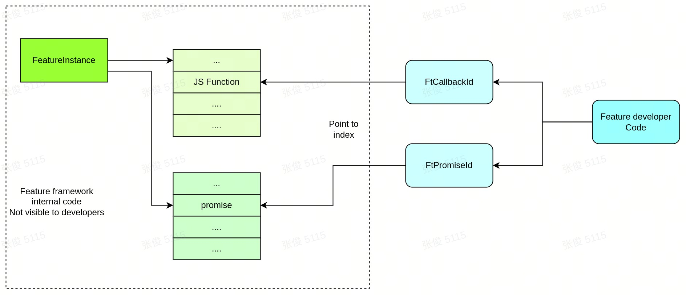
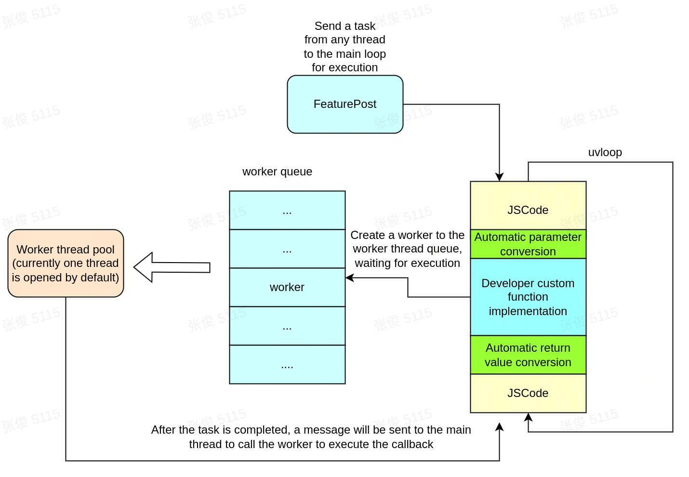

# README

## Feature Framework

In Quick App development, new capabilities need to be added to enhance the app's functionality, and these capabilities are typically implemented using C/C++ programming languages. The Feature Framework is a framework, SDK, and toolset that assists system developers in extending the functionality of Quick Apps.




## Feature Framework Capabilities

The capabilities provided by the Feature Framework consist of a runtime framework, APIs, and the JIDL language and tools.
- Provides an execution framework for calling Native code from the JS layer.
- The Feature Framework API offers a set of interfaces for interaction between Native code and JS.
- JIDL is an interface description language used to automatically generate interfaces for mutual calls between JS and Native code.



### Conceptual Model of Feature

#### Static Conceptual Model

Since a Feature provides interfaces from Native to JS, the concept of Feature also follows the concepts in JS.

A Feature has 3 levels of concepts:

- Module: A Feature is a module, equivalent to a program module in C language. It does not have instances and exists globally.
- Prototype: The prototype, similar to the prototype object in JS, is akin to a class in C++, but with differences. Each Quick App instance generates a Prototype. All functions and properties of the Feature are managed on the Prototype.
- Instance: An instance, where multiple instances exist within an app (one instance is created each time a require call is made). The instance stores all the processed data.

Specifically in Quick Apps:

- A Quick App instance has only one Prototype.
- A Quick App page generally contains only one instance of a Feature.

From the system perspective, this is how the concept of Feature works.



#### Runtime Conceptual Model

Each Feature can be associated with Native data, and the associated content may vary. The runtime conceptual model is as follows:



#### Feature Lifecycle



### Interface Capabilities Provided by the Feature Framework

#### Automatically Generate Feature Prototype and Instance

The Feature Framework helps developers create the Prototype and Instance of a Feature. 

1. Developers need to provide a FeatureDescription, which contains the following information about the Feature:
   1. The name of the Feature
   2. The components (members) of the Feature
      - The methods supported by the Feature, including:Method name, Parameter list, Return values, Implementation callback functions
      - The names, types, and implementation functions for properties
      - others
2. Based on the provided FeatureDescription, the Feature Framework generates the FeaturePrototype and FeatureInstance, which are then returned to the developer in the form of `FeatureProtoHandle` and `FeatureInstanceHandle` respectively. These handles enable the developer to access and manage the Feature’s Prototype and Instance within the app



#### Providing Parameter Conversion

From JS to Native, the Feature Framework provides parameter conversion capabilities, allowing JS parameters to be converted into regular parameters. The table below outlines the basic conversion capabilities:

| **JS Type**     | **C Type**                | **Description**                                                     |
| ------------------ | ------------------------ | ------------------------------------------------------------ |
| number/boolean | int, float, double, bool | The JS number type is represented as a floating-point number. Based on JIDL definitions, it can be converted to compatible types like int, float, etc. Converting to int or bool will lose the decimal part. |
| string             | FtString                 | A typedef for const char*.                                         |
| object             | struct pointer (FtAny pointer)    | If a struct is defined in JIDL, it will be converted to the corresponding C structure pointer. If defined as object or any, it is directly represented as FtAny. |
| array              | FtArray pointer              | Converted into a C structure FtArray pointer.                                      |
| function           | FtCallbackId             | Converted into an integer representing the CallbackId.                                 |
| promise            | FtPromiseId              | Converted into an integer representing the PromiseId.                                 |


Pointer objects come with reference counting, which means they are automatically managed.
- Developers can release them using `FeatureDupValue` and `FeatureFreeValue`.
- Pointers passed as parameters do not require additional manual release.

The diagram below shows the management mechanisms for Callback and Promise.



The Feature Framework achieves two main objectives by hiding implementation details:
- Simplifies Developer Workload: Feature developers do not need to worry about the underlying details, such as managing the lifecycle of Callbacks and Promises. The framework automatically handles these aspects, allowing developers to focus on the functionality of the feature itself.
- Provides Memory Management: The FeatureInstance offers built-in memory management methods, ensuring that memory is properly handled and preventing memory leaks. This makes it easier for developers to manage resources without needing to manually track or release memory.

#### Asynchronous Programming Model

Feature code and JS code run in the same uvloop. Feature developers need to pay attention to their call duration. They cannot be blocked in ordinary functions.



- Add a task to the worker queue
- Any thread can call `FeaturePost` to add a task to the main loop queue

### Interface description provided by JIDL

JIDL is used to describe the interface of Feature, the following is a simple feature file.

```C++
// module name
module test@1.0

callback cb(int a, int b);

void foo(int a, float b, string c);

void goo(int a, cb cb1);

property string name;
property int age;
```

- Comment style similar to C++ language
- Always starts with `module`, including module name and version
- Can define properties, functions, interfaces, etc.

File definition

1. The file name ends with `.jidl`
2. The file name is generally `<feature name>_<version number>.jdil`, but it is not mandatory

In module naming, Developers can use the `.` sign, such as `system.fetch`